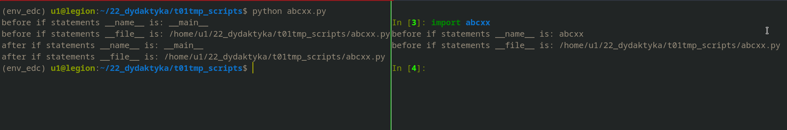

# Basic scripts structure

```
First part: import section


Second part: functions' definitions


Third part: if module name is '__main__' it is script

if statement - if __name__ == '__main__':


Fourth part: executable part
```

```python
print(f'before if statements __name__ is: {__name__}')
print(f'before if statements __file__ is: {__file__}')


if __name__ == '__main__':
    print(f'after if statements __name__ is: {__name__}')
    print(f'after if statements __file__ is: {__file__}')
```


